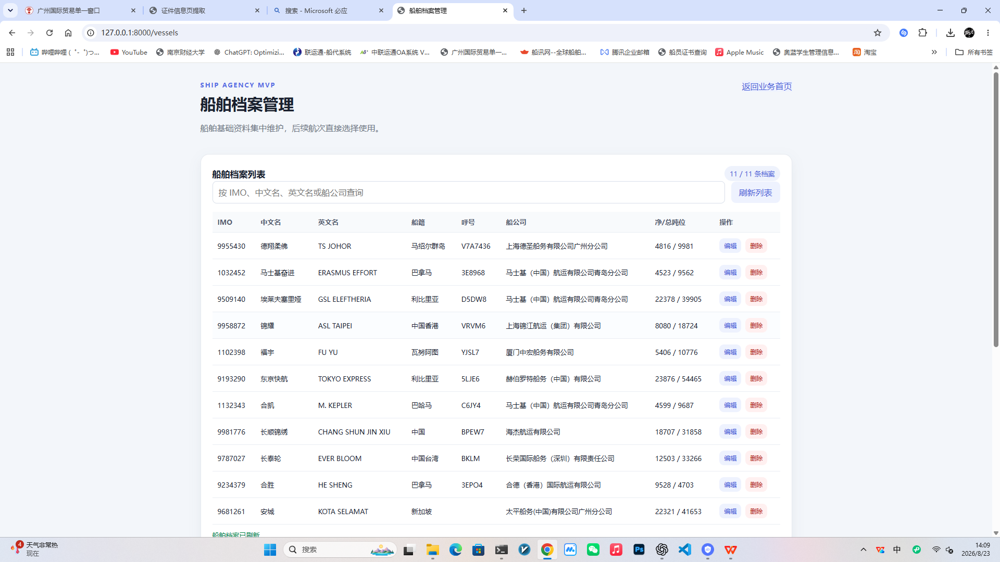
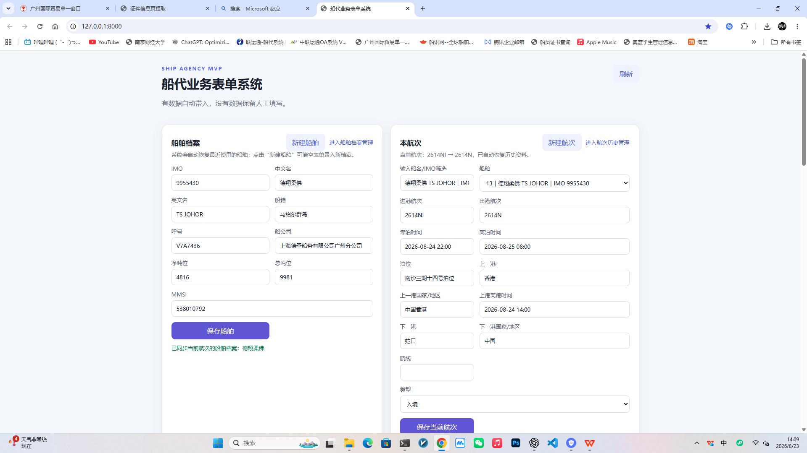
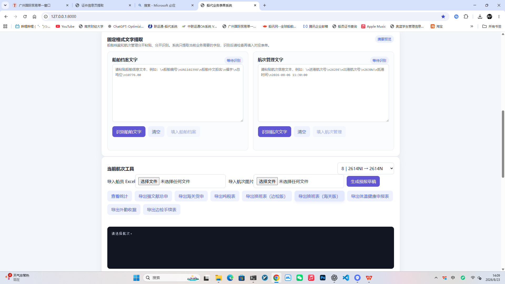
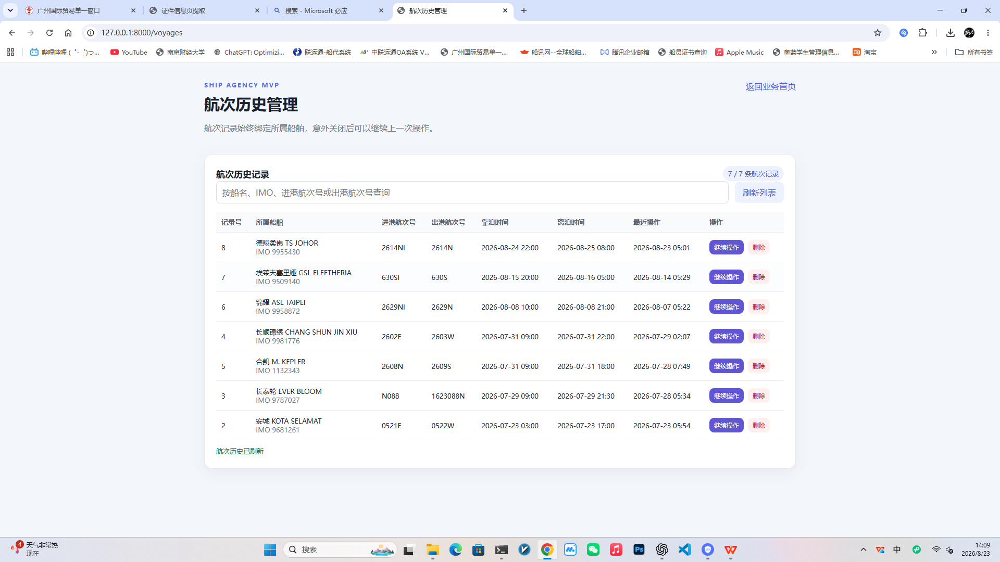

# 船代业务表单系统 MVP

第一版采用 FastAPI + SQLAlchemy + SQLite，前端为轻量静态页面，方便先验证业务流程。后续可以在不改变业务数据模型的情况下替换为 PostgreSQL，并将前端迁移为 Vue 3 + TypeScript。

## 启动

```powershell
py -m venv .venv
.\.venv\Scripts\python -m pip install -r requirements.txt
$env:PLAYWRIGHT_BROWSERS_PATH = "$pwd\.playwright-browsers"
.\.venv\Scripts\python -m playwright install chromium
$env:PYTHONPATH='backend'
.\.venv\Scripts\python -m uvicorn app.main:app --reload
```

打开 http://127.0.0.1:8000 。

桌面已提供“船代系统一键启动”快捷方式，双击即可启动服务并打开浏览器。

## Windows 一键安装包

在已配置开发环境的电脑上运行：

```powershell
.\installer\build_installer.ps1
```

安装包生成在 `installer/release/ShipAgencySetup.exe`。目标电脑无需安装 Python、Node.js 或 SQLite，安装后桌面会创建“船代业务系统”快捷方式。业务数据库保存在安装目录下的 `data` 文件夹，卸载程序默认保留该文件夹。

当前实现：船舶档案、航次、`.xls/.xlsx` 船员名单导入、船员统计、海员证逐人核验、换班记录、吨税申请数据保存、预报文本生成。

导入船员名单后，当前航次工具会显示中国籍海员证人员。点击“核验中国籍海员证”后，系统以低频率逐人访问海事局查询页面，完成一人后立即在页面显示证件状态、签发机关和有效日期。该功能需要联网，并需要在开发环境安装 Playwright Chromium；安装包构建时也应将对应浏览器运行时一并打包。

云端部署建议使用 Alibaba Cloud Linux 3 或 Ubuntu LTS，Node.js 仅需安装 `package.json` 中声明的导出依赖；健康申报表导出使用 Python/OpenPyXL，不依赖 Windows 专用组件。生产环境应使用 PostgreSQL，并通过反向代理提供 HTTPS 访问。

## 界面截图









默认数据库是 `data/ship_agency.db`。后期切换 PostgreSQL 时，只需设置 `DATABASE_URL`，例如使用 `postgresql+psycopg://...`，业务接口不变。
